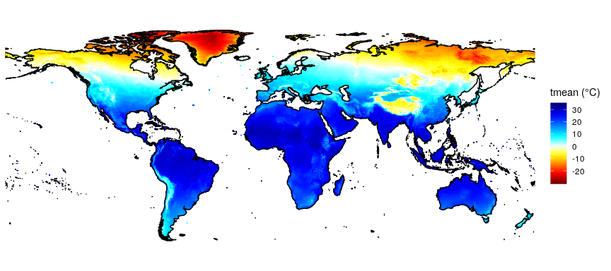

rISIMIP - R package for accessing and analysing ISIMIP Environmental
Data
================

## Overview

`rISIMIP` is an R package for <!--downloading,--> accessing and
analysing data provided by the Inter-sectoral Impact Model
Intercomparison Project (ISIMIP). Data from the ISIMIP Fast Track is
available from the [ISIMIP node of the ESGF
server](https://esg.pik-potsdam.de/projects/isimip-ft/), ISIMIP2a data
is available from [ISIMIP node of the ESGF
server](https://esg.pik-potsdam.de/projects/isimip2a/) and ISIMIP2b data
from [ISIMIP node of the ESGF
server](https://esg.pik-potsdam.de/projects/isimip2b/). For more
information on the different data types have a look at the [ISIMIP
Website](https://www.isimip.org/). The package currently consists of two
functions:

<!--* `getISIMIP()` downloads ISIMIP data-->

  - `readISIMIP()` reads and pre-processes ISIMIP data
  - `listISIMIP()` creates a list of requested ISIMIP data files

You can learn more about them in `vignette("rISIMIP")`.

An example of extracting country-specific data from ISIMIP2b can be
found in `vignette("country-specific")`.

## Installation

To *use* the package, install it directly from GitHub using the
`remotes` package:

``` r
# Install remotes if not previously installed
if(!"remotes" %in% installed.packages()[,"Package"]) install.packages("remotes")

# Install rISIMIP from Github if not previously installed
if(!"rISIMIP" %in% installed.packages()[,"Package"]) remotes::install_github("RS-eco/rISIMIP", build_vignettes = TRUE)
```

**If you encounter a bug or if you have any problems, please file an
issue on Github.**

## Usage

``` r
# Load rISIMIP package
library(rISIMIP)
```

### List ISIMIP files

The function `listISIMIP` just lists all climate files for the desired
time period, model and variable. The files can then be put into the
`aggregateNC` function of the `processNC` package for processing the
required NetCDF files.

``` r
# List urban area file for histsoc scenario
listISIMIP(path="/media/matt/Data/Documents/Wissenschaft/Data/", type="landuse", scenario="histsoc", 
           var="urbanareas", startyear=1861, endyear=2005)
```

    [1] "/media/matt/Data/Documents/Wissenschaft/Data//ISIMIP2b/InputData/landuse/histsoc/histsoc_landuse-urbanareas_annual_1861_2005.nc4"

**Note:** The path must lead to a file directory on your computer, which
contains the required ISIMIP files. You can download the required ISIMIP
data files from: <https://esg.pik-potsdam.de/search/isimip/>

### Read ISIMIP files

With `readISIMIP` you can read one or multiple ISIMIP datafiles into a
raster stack.

``` r
# Read urban area file for 2005soc scenario
(urbanareas_1970_1999 <- readISIMIP(path="/media/matt/Data/Documents/Wissenschaft/Data/", 
                                    type="landuse", scenario="histsoc", var="urbanareas", 
                                    startyear=1970, endyear=1999))
```

    class      : RasterStack 
    dimensions : 360, 720, 259200, 30  (nrow, ncol, ncell, nlayers)
    resolution : 0.5, 0.5  (x, y)
    extent     : -180, 180, -90, 90  (xmin, xmax, ymin, ymax)
    crs        : +proj=longlat +datum=WGS84 +ellps=WGS84 +towgs84=0,0,0 
    names      : X1970, X1971, X1972, X1973, X1974, X1975, X1976, X1977, X1978, X1979, X1980, X1981, X1982, X1983, X1984, ... 
    Date        : 1970 - 1999 (range)

However, this is not useful if you are interested in long time periods,
as one datafile is about 7 GB in size and you will quickly run into
memory limitations.

\#\#Internal data

`rISIMIP` contains various pre-processed data. See the *data-raw* folder
for how we derived the included datasets.

### Temperature thresholds

Annual global mean temperature as well as the 31-year running mean were
calculated for each GCM and four RCPs (RCP2.6, RCP4.5, RCP6.0 and
RCP8.5). Furthermore, the year when the 31-year runnning mean of global
mean temperature crosses a certain temperature threshold has been
calculated. The data has been provided by ISIMIP and a summary of it can
be accessed from the `vignette("temperature-thresholds")` vignette and
is also available from [the ISIMIP
Website](https://www.isimip.org/protocol/temperature-thresholds-and-time-slices/).

### Landseamask

The landseamask used by ISIMIP has been included in the package and can
be accessed by:

``` r
data("landseamask_generic")
```

### Bioclimatic data

Current and future bioclimatic data for two 30-yr periods (1995 & 2080)
was derived from the EWEMBI
(<https://esg.pik-potsdam.de/search/isimip/?project=ISIMIP2b&product=input_secondary&dataset_type=Climate+atmosphere+observed>)
and ISIMIP2b data
(<https://esg.pik-potsdam.de/search/isimip/?project=ISIMIP2b&product=input&dataset_type=Climate+atmosphere+simulated>)
and is included in this package.

**EWEMBI - 1995**

``` r
data("bioclim_ewembi_1995_landonly")

library(dplyr); library(sf); library(ggplot2)
data(outline, package="ggmap2")
outline <- sf::st_as_sf(outline)
col_val <- scales::rescale(unique(c(seq(min(bioclim_ewembi_1995_landonly$bio1), 0, length=5),
                                 seq(0, max(bioclim_ewembi_1995_landonly$bio1), length=5))))

bioclim_ewembi_1995_landonly %>% select(x,y,bio1) %>% 
  ggplot() + geom_tile(aes(x=x, y=y, fill=bio1)) + 
        geom_sf(data=outline, fill="transparent", colour="black") + 
        scale_fill_gradientn(name="tmean (°C)", colours=rev(colorRampPalette(
          c("#00007F", "blue", "#007FFF", "cyan", 
            "white", "yellow", "#FF7F00", "red", "#7F0000"))(255)),
          na.value="transparent", values=col_val, 
          limits=c(min(bioclim_ewembi_1995_landonly$bio1)-2, 
                   max(bioclim_ewembi_1995_landonly$bio1)+2)) + 
        coord_sf(expand=F, 
                 xlim=c(min(bioclim_ewembi_1995_landonly$x), 
                        max(bioclim_ewembi_1995_landonly$x)), 
                 ylim=c(min(bioclim_ewembi_1995_landonly$y),
                        max(bioclim_ewembi_1995_landonly$y)), 
                 ndiscr=0) + theme_classic() + 
        theme(axis.title = element_blank(), axis.line = element_blank(),
              axis.ticks = element_blank(), axis.text = element_blank(),
              plot.background = element_rect(fill = "transparent"), 
              legend.background = element_rect(fill = "transparent"), 
              legend.box.background = element_rect(fill = "transparent", colour=NA))
```

<!-- -->

**RCP2.6 - 2080**

``` r
data("bioclim_gfdl-esm2m_rcp26_2080_landonly")
data("bioclim_hadgem2-es_rcp26_2080_landonly")
data("bioclim_ipsl-cm5a-lr_rcp26_2080_landonly")
data("bioclim_miroc5_rcp26_2080_landonly")

bioclim_rcp26_2080_landonly <- bind_rows(`bioclim_gfdl-esm2m_rcp26_2080_landonly`, 
                                         `bioclim_hadgem2-es_rcp26_2080_landonly`, 
      `bioclim_ipsl-cm5a-lr_rcp26_2080_landonly`, bioclim_miroc5_rcp26_2080_landonly) %>% 
  select(x,y,bio1) %>% group_by(x,y) %>% summarise(bio1=mean(bio1, na.rm=T))

ggplot() + geom_tile(data=bioclim_rcp26_2080_landonly, aes(x=x, y=y, fill=bio1)) + 
        geom_sf(data=outline, fill="transparent", colour="black") + 
        scale_fill_gradientn(name="tmean (°C)", colours=rev(colorRampPalette(
          c("#00007F", "blue", "#007FFF", "cyan", 
            "white", "yellow", "#FF7F00", "red", "#7F0000"))(255)),
          na.value="transparent", values=col_val, 
          limits=c(min(bioclim_rcp26_2080_landonly$bio1)-2, 
                   max(bioclim_rcp26_2080_landonly$bio1)+2)) + 
        coord_sf(expand=F, 
                 xlim=c(min(bioclim_rcp26_2080_landonly$x), 
                        max(bioclim_rcp26_2080_landonly$x)), 
                 ylim=c(min(bioclim_rcp26_2080_landonly$y),
                        max(bioclim_rcp26_2080_landonly$y)), 
                 ndiscr=0) + theme_classic() + 
        theme(axis.title = element_blank(), axis.line = element_blank(),
              axis.ticks = element_blank(), axis.text = element_blank(),
              plot.background = element_rect(fill = "transparent"), 
              legend.background = element_rect(fill = "transparent"), 
              legend.box.background = element_rect(fill = "transparent", colour=NA))
```

<!-- -->

**RCP6.0 - 2080**

``` r
data("bioclim_gfdl-esm2m_rcp60_2080_landonly")
data("bioclim_hadgem2-es_rcp60_2080_landonly")
data("bioclim_ipsl-cm5a-lr_rcp60_2080_landonly")
data("bioclim_miroc5_rcp60_2080_landonly")

bioclim_rcp60_2080_landonly <- bind_rows(`bioclim_gfdl-esm2m_rcp60_2080_landonly`, 
                                         `bioclim_hadgem2-es_rcp60_2080_landonly`, 
      `bioclim_ipsl-cm5a-lr_rcp60_2080_landonly`, bioclim_miroc5_rcp60_2080_landonly) %>% 
  select(x,y,bio1) %>% group_by(x,y) %>% summarise(bio1=mean(bio1, na.rm=T))

ggplot() + geom_tile(data=bioclim_rcp60_2080_landonly, aes(x=x, y=y, fill=bio1)) + 
  geom_sf(data=outline, fill="transparent", colour="black") + 
  scale_fill_gradientn(name="tmean (°C)", colours=rev(colorRampPalette(
          c("#00007F", "blue", "#007FFF", "cyan", 
            "white", "yellow", "#FF7F00", "red", "#7F0000"))(255)),
          na.value="transparent", values=col_val, 
          limits=c(min(bioclim_rcp26_2080_landonly$bio1)-2, 
                   max(bioclim_rcp26_2080_landonly$bio1)+2)) + 
        coord_sf(expand=F, 
                 xlim=c(min(bioclim_rcp26_2080_landonly$x), 
                        max(bioclim_rcp26_2080_landonly$x)), 
                 ylim=c(min(bioclim_rcp26_2080_landonly$y),
                        max(bioclim_rcp26_2080_landonly$y)), 
                 ndiscr=0) + theme_classic() + 
        theme(axis.title = element_blank(), axis.line = element_blank(),
              axis.ticks = element_blank(), axis.text = element_blank(),
              plot.background = element_rect(fill = "transparent"), 
              legend.background = element_rect(fill = "transparent"), 
              legend.box.background = element_rect(fill = "transparent", colour=NA))
```

<!-- -->
